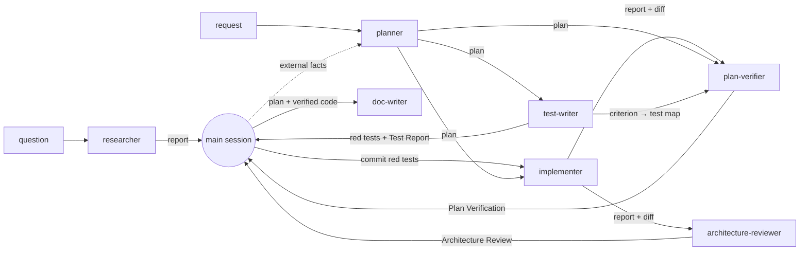

# Agents

This file maps the project's Claude Code subagents: who does what, with which permissions, and
which artifact moves between them. It doesn't repeat the prompts. Each agent's behaviour lives in
its own `.md` file, so read that file before you change the agent.

## The set at a glance

| Agent | Responsibility | Model | Permissions | Input | Output |
|---|---|---|---|---|---|
| [researcher](researcher.md) | Answers one concrete question from the repo or from external sources, with evidence and an explicit "not found" list | `sonnet` | Read-only in the repo (`Read, Grep, Glob`); `WebSearch`, `WebFetch`; NotebookLM create/add/query only (no delete, share or studio) | A question plus its scope (repo / external / both) and what it feeds | **Repo report** or **External report**, or clarifying questions |
| [planner](planner.md) | Turns a request into a Development Plan that respects modules, skills, rules and `INSIGHTS.md` | `opus` | Read-only: `Read, Grep, Glob` (no `Skill`, `Bash`, `Write` or web) | A feature or change request (optionally a researcher report) | **Development Plan** (`Status: ready`) or clarifying questions (`needs-answers`) |
| [test-writer](test-writer.md) | Writes tests for BE and UI in two modes: red-first from a plan's acceptance criteria, or backfill for existing code | `sonnet` | `Read, Grep, Glob, Edit, Write, Bash, Skill`; hooks limit writes to test paths and Bash to the `test` profile; every test run inside `srt`; writes but doesn't run integration tests or e2e | A plan (red-first) or named files (backfill) | **Test Report**: criterion → test → evidence, plus test files in the working tree |
| [implementer](implementer.md) | Executes the plan in the backend and the UI, self-reviews how its own code is written, and runs typecheck plus the existing unit tests | `sonnet` | `Read, Grep, Glob, Edit, Write, Bash, Skill`; preloads `engineering-insights`, `onion-architecture`, `frontend-ui-architecture`; no commit, push or research | A Development Plan with `Status: ready` | **Implementation Report** (`done` / `partial` / `blocked`) plus uncommitted changes in the working tree |
| [architecture-reviewer](architecture-reviewer.md) | Checks a diff against the onion and client boundaries, runs `lint:boundaries` and the route test, reports what the lint can't see | `opus` | Read-only: `Read, Grep, Glob, Bash`; a hook limits Bash to the `architecture` profile; preloads both architecture skills | A target (`base..head`, branch or uncommitted tree) | **Architecture Review**: findings with severity, rule, `path:line` and evidence; `pass` / `fail` |
| [plan-verifier](plan-verifier.md) | Checks finished code against every plan item and traces every hunk back to the plan; no advice | `sonnet` | Read-only: `Read, Grep, Glob, Bash`; a hook limits Bash to the `verify` profile | A plan, a target, optionally the Test Report | **Plan Verification**: a verdict with evidence per item, unmapped changes; `verified` / `gaps` |
| [doc-writer](doc-writer.md) | Documents implemented features and turns plans or other material into docs with Mermaid diagrams, in the right `docs/` or `specs/` section | `sonnet` | `Read, Grep, Glob, Edit, Write, Skill`, no Bash; a hook limits writes to docs paths; preloads `mermaid-diagram` | A subject plus material (plan, report, verified code) | **Documentation Report**: files, claim → `path:line`, index updates, ADR and insight candidates |

All seven are flat: none has the `Agent` tool, so none spawns subagents.

None of them can ask the user, because Claude Code removes `AskUserQuestion` from every subagent.
When the input is too vague to act on, each agent returns its questions to the calling session,
and that session asks the user.

None of them writes `INSIGHTS.md` except the implementer, through its preloaded
`engineering-insights`. The others end their report with **Insight candidates**, and the main
session records them through that skill.

## How they connect



The main session is the orchestrator. It passes each artifact on verbatim, because a subagent
sees no conversation history. The red-first leg is optional: without it, test-writer can run in
backfill mode after the implementer.

## Who owns which check

The planner writes each check under *Checks for reviewers* with its owner, and the implementer's
**Handoff to reviewers** repeats that split.

| Check | Owner |
|---|---|
| typecheck and the existing unit tests of each touched package | implementer |
| `pnpm lint:boundaries`, the onion-architecture step 9 report, `route-adapter-calls.test.ts` | architecture-reviewer |
| acceptance verification | plan-verifier |
| integration tests (`*.it.test.ts`, Docker) as a review check | plan-verifier, after the main session has read test-writer's new ones |
| red-first run of test-writer's integration tests | main session (Docker can't run inside test-writer's sandbox) |
| unchanged red-first tests | plan-verifier |
| e2e (`npm run e2e:hermetic`) | main session: it rebuilds `client/.next` and breaks a running dev server (`e2e/INSIGHTS.md`), and its ports live in `CLAUDE.local.md` |
| `pr-self-review` | main session: it writes a verdict artifact |
| security review, including the agent hooks | main session (`/security-review`); there is no security agent |

Scope splits that are easy to get wrong:
- **researcher vs. planner.** The planner doesn't browse. When a plan needs external facts, the
  planner lists them under *Risks & open questions*, and the caller runs `researcher`.
- **test-writer vs. implementer.** The test-writer writes only tests, and the implementer only
  code. Red-first tests are read-only for the implementer, so neither can grade its own work.
- **architecture-reviewer vs. pr-self-review.** The reviewer covers the two architecture skills
  in depth and runs their checks. `pr-self-review` routes the whole diff to every skill and gates
  `gh pr create`.
- **plan-verifier vs. the global `validator`.** The validator checks a one-line definition of
  done and suggests fixes. plan-verifier requires a plan, traces it in both directions and gives
  no advice.
- **doc-writer vs. ADRs and INSIGHTS.** doc-writer describes what exists. Why a choice was made
  goes to an ADR in `../decisions/`, and a trap worth remembering goes to `INSIGHTS.md`. The main
  session writes both from the report's candidates.

## How the limits are enforced

Four mechanisms. The hooks live in `.claude/hooks/`, the sandbox in `.claude/sandbox/`. All but
one step of the audit are wired from agent frontmatter, so they apply to these agents and
nothing else:

- `agent-bash-allowlist.py <architecture | verify | test>` splits the command into words itself
  and allows it only when those words form one of the listed shapes. It refuses every character
  the shell would expand or interpret (braces, `$`, globs, `\`, double quotes, operators), so the
  program receives exactly the words that were checked; literal arguments go in single quotes.
  Git long options are matched with git's abbreviation rule, and `--dir` / `--prefix` must be a
  package of this repo or one of its worktrees, never a directory under `server/clones/`. Each
  agent's **Commands you may run** section lists the allowed forms.
- `agent-write-scope.py <tests | docs>` resolves the target path against `$CLAUDE_PROJECT_DIR`
  and allows only the profile's paths. `tests` also denies adding `.skip`/`.only`/`.todo` and
  removing `it(`/`test(`/`expect(` calls from an existing file, and it keeps test-writer out of
  `server/test/helpers/` and out of any path with `.it.test` before the file suffix, because
  the unsandboxed integration suite imports the helpers and selects files by that substring.
  `docs` denies `INSIGHTS.md`,
  `CLAUDE.md`, `AGENTS.md`, the root README, `docs/skills/**` and the product prompts.
- `.claude/sandbox/run-tests.sh` runs every command that executes repo code — tests, and
  `lint:boundaries`, whose config is JavaScript — inside Anthropic's `srt`
  (`@anthropic-ai/sandbox-runtime`, `npm install -g`). The process may write only to a fresh temp
  dir, vitest's results cache (`node_modules/.vite/vitest`, data only; vite's dependency cache,
  which is code, stays read-only) and vite's config temp files (`test-run.srt.json`), and gets no network and
  no Unix sockets. That is what stops a test from writing where the write-scope hook can't see:
  a test is code, and `fs.writeFileSync` or `child_process` inside it never passes through
  Write/Edit. The allowlist refuses those runs without the wrapper. srt can't start inside
  another macOS sandbox, so in a session whose Bash is sandboxed the agent runs the wrapped
  command with `dangerouslyDisableSandbox`, which the allowlist accepts for wrapped commands only.
- `agent-write-audit.py <tests | docs | none>` records `git status` plus content hashes on the
  agent's first tool call and compares at SubagentStop, writing the result to the git dir. A
  PostToolUse hook on the `Agent` tool, registered in `.claude/settings.json` (profile
  `report`), hands any problem to the main session as `additionalContext`: a changed file
  outside the profile's paths, a moved HEAD, or an audited agent whose audit never ran (its
  definition was loaded before its hooks existed). A background call returns at launch, before
  any result exists, so it leaves a marker and a `UserPromptSubmit` hook (also in
  `settings.json`) reports when the agent's completion notification arrives. A SubagentStop
  `systemMessage` would not do:
  it lands in the subagent's own transcript. The audit catches what the other mechanisms miss
  inside the repo; it can't see writes outside it.

The hooks deny with JSON (`permissionDecision: "deny"`) and exit 0, and fail closed: any error
inside a hook is a deny (the audit instead reports that it could not check). Regression tests,
including the bypasses found in the 2026-09-24 security review, run with
`python3 -m unittest discover -s .claude/hooks/tests`.

**What stays open, deliberately.** Integration tests (`*.it.test.ts`) need Docker, and Docker
access escapes any sandbox (a container can mount the host). So test-writer writes them but
doesn't run them, and the main session reads every file test-writer added or changed before
anything runs with Docker: its own red-first run, or plan-verifier's integration suite, which
runs only when the brief says that reading happened, and only in this checkout (the allowlist
refuses another worktree's `server` for it). Because test-writer can't write shared helpers or
`.it.test` paths other than `*.it.test.ts`, the files that suite runs from test-writer are
exactly its `*.it.test.ts` files and whatever test files those import.

None of this relies on `permissionMode`, because the main session's `bypassPermissions`,
`acceptEdits` and `auto` modes override a subagent's `permissionMode`. Test a hook by piping a
PreToolUse JSON into it:

```sh
echo '{"tool_name":"Bash","tool_input":{"command":"rm x"}}' | .claude/hooks/agent-bash-allowlist.py architecture
```

## Shared contract: which skills govern which paths

The planner, the implementer and the test-writer read the surface→skill routing table in step
3 of [`../skills/pr-self-review/SKILL.md`](../skills/pr-self-review/SKILL.md). They read it with
Read and never invoke the skill, because invoking it runs the review. The architecture-reviewer
cites severities from step 5 of the same file.

The planner writes the skills into every step. The implementer invokes each named skill, or
explains the skip under *Deviations*. The test-writer loads only the routed skills that carry
test rules. Change that table and you change four agents.

## Where their rules come from

**researcher** follows the NotebookLM research gate from Glib's global rules
(`~/.claude/rules/research-gate.md`): existing notebooks first, `research_import` before
querying, and the fast/deep mode rules stated in its file.

The other agents rest on these sources, checked on 2026-09-24:

| Source | Rule taken | Applied in |
|---|---|---|
| [Claude Code — Subagents](https://code.claude.com/docs/en/sub-agents) | Omitting `tools` inherits everything; `disallowedTools` is applied first | Explicit `tools` and `disallowedTools` in every agent |
| same | `AskUserQuestion` is always removed from subagents | The gate that returns `needs-answers` / `blocked` |
| same | `skills:` injects full skill bodies; others stay reachable through `Skill` | Preloads in implementer, architecture-reviewer, doc-writer |
| same | A subagent inherits no history, invoked skills or permission approvals; it does get CLAUDE.md and CLAUDE.local.md | Self-contained plans and reports; every agent re-reads `INSIGHTS.md` itself |
| same | The main session's permission mode overrides a subagent's `permissionMode`; frontmatter hooks (`PreToolUse`) apply to the subagent | The two hooks instead of `permissionMode: plan` |
| same | `description` drives delegation; `maxTurns` bounds a run | Every description says when not to use the agent and names its neighbour |
| [Claude Code — Sandboxing](https://code.claude.com/docs/en/sandboxing) | Subagents share the session's sandbox config (no per-agent sandbox); access to `docker.sock` is effectively a sandbox escape; the primitives ship as `@anthropic-ai/sandbox-runtime` | A per-command `srt` wrapper for test and lint runs; integration tests leave the sandbox only after the main session reads them |
| [anthropics/sandbox-runtime](https://github.com/anthropics/sandbox-runtime) | `srt --settings <file> <cmd>`; writes and network denied unless listed; Seatbelt on macOS; beta | `.claude/sandbox/run-tests.sh` and `test-run.srt.json` |
| [Claude Code — Hooks](https://code.claude.com/docs/en/hooks) | Hooks inside a subagent get `agent_id`; a frontmatter `Stop` hook becomes `SubagentStop`; PostToolUse `additionalContext` reaches the model (live check: a SubagentStop `systemMessage` stays in the subagent's transcript) | `agent-write-audit.py`'s per-agent baseline, result file and PostToolUse(Agent) report |
| [Claude Code — Skills](https://code.claude.com/docs/en/skills) | Progressive disclosure: a skill body loads only when it's used | Only what each agent needs is preloaded |
| [Claude Code — Best practices](https://code.claude.com/docs/en/best-practices) | Explore → Plan → Implement → Commit; "if you could describe the diff in one sentence, skip the plan" | A read-only planner; the implementer never commits |
| same | "Have one Claude write tests, then another write code to pass them"; "write a failing test that reproduces the issue, then fix it" | test-writer's red-first mode; red tests read-only for the implementer |
| same | Review in a fresh context; tell a reviewer to flag only gaps against correctness or the stated requirements | Separate reviewers; plan-verifier's template has no advice section |
| [Anthropic — Building Effective Agents](https://www.anthropic.com/engineering/building-effective-agents) | Start with the simplest thing; orchestrator–workers | Flat agents; the main session orchestrates; the routing table is reused, not re-created |
| [GitHub spec-kit](https://github.com/github/spec-kit) | spec → plan → tasks → implement, with acceptance criteria per task; `/analyze` reports coverage per requirement with severity | The plan's *Acceptance criteria*; plan-verifier's per-item table |
| [ISO/IEC/IEEE 29148:2018](https://www.iso.org/standard/72089.html) | Traceability in both directions | plan-verifier's reverse map (**Unmapped changes**) |
| [Anthropic — Define success criteria](https://docs.anthropic.com/en/docs/test-and-evaluate/define-success) | Specific, measurable criteria; grade per criterion, reason before the verdict | plan-verifier's discrete verdicts with evidence |
| [anthropics code-review plugin](https://github.com/anthropics/claude-plugins-official/blob/main/plugins/code-review/commands/code-review.md) | Cite lines; drop low-confidence findings; don't repeat what linters catch; "no issues" is a valid result | architecture-reviewer's `verified` / `plausible` marker and its relation to `lint:boundaries` |
| [Building Evolutionary Architectures](https://www.thoughtworks.com/radar/techniques/architectural-fitness-function) (Ford, Parsons, Kua) | Protect architecture with automated fitness functions | `lint:boundaries` and the route test stay the gate; the reviewer covers what they can't express |
| [dependency-cruiser rules](https://github.com/sverweij/dependency-cruiser/blob/main/doc/rules-reference.md) | Rules match static import edges | The reviewer's list of what lint can't see (container calls, placement) |
| [Claude 3.7 Sonnet](https://www.anthropic.com/claude-3-7-sonnet-system-card) and [Claude 4](https://www.anthropic.com/claude-4-system-card) system cards | Models may special-case tests to make them pass | test-writer's no-weakening limits and the `tests` hook |
| [TestGen-LLM at Meta](https://arxiv.org/abs/2402.09171) (FSE 2024) | Keep a generated test only if it builds and passes reliably across repeated runs | Backfill's five green runs |
| [Mutation-guided test generation at Meta](https://arxiv.org/abs/2501.12862) | Coverage alone doesn't show a test can fail; mutants do | Backfill's named mutant per test |
| [Testing Library — Guiding principles](https://testing-library.com/docs/guiding-principles), [query priority](https://testing-library.com/docs/queries/about#priority) | Test the way the software is used; `getByRole` first, `getByTestId` last; `userEvent` | test-writer's client rules |
| [Kent C. Dodds — Testing implementation details](https://kentcdodds.com/blog/testing-implementation-details) | Implementation-detail tests break on refactor and miss bugs | Assert what the user sees |
| [Vitest — Mocking](https://vitest.dev/guide/mocking) | Mock at boundaries; restore mocks between tests | test-writer's server rules |
| [Diátaxis](https://diataxis.fr/) | Four kinds of docs by user need; apply iteratively | doc-writer's tie-breaker, not a new structure |
| [Write the Docs — Docs as code](https://www.writethedocs.org/guide/docs-as-code/) | Docs live in the repo and go through review | Docs written into package `docs/` in the same PR |
| [Nygard — Documenting Architecture Decisions](https://cognitect.com/blog/2011/11/15/documenting-architecture-decisions) | An ADR records one decision and doesn't change; feature docs describe the current state | ADR candidates go to the main session |
| [Google style — Timeless documentation](https://developers.google.com/style/timeless-documentation) | Document the current state; no "new" or "now" | doc-writer's wording rule |
| [C4 model](https://c4model.com/), [Mermaid on GitHub](https://github.blog/developer-skills/github/include-diagrams-markdown-files-mermaid/) | Context and Container levels carry most value; Mermaid renders natively and diffs as text | doc-writer's diagram rule |

Judgement calls that are **not** from these sources:
- the model split (Opus plans and reviews architecture; Sonnet executes, writes tests, verifies
  and documents);
- re-reading the plan's Constraints before each step (a goal-drift guard);
- limiting the implementer's self-review to code writing plus the existing tests;
- the 150-call budget and the stop after two failed attempts;
- five green runs and a named mutant instead of running a mutation tool;
- the fail-closed allowlists and the ban on shell metacharacters;
- integration tests owned by plan-verifier, e2e by the main session;
- the `verified` / `plausible` marker instead of a 0–100 confidence score;
- reviewers and writers report insight candidates instead of recording them.

Repo rules the agents follow come from the root and package `CLAUDE.md` files,
`.claude/rules/*.md`, and the skills in `.claude/skills/`.

## Adding or changing an agent

- Keep the shape the existing files share: frontmatter, then hard limits, gate, procedure, and
  output template.
- Give `tools` explicitly, and `disallowedTools` for what must never be reachable.
- An agent that must not write gets no `Edit`/`Write`. An agent that runs Bash gets a profile in
  `agent-bash-allowlist.py`, and its prompt lists the exact command forms.
- Add the agent to the table at the top of this file and to the check-ownership table. If its
  input or output feeds another agent, update the diagram too.
