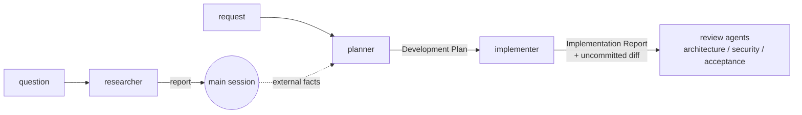

# Agents

This file maps the project's Claude Code subagents: who does what, with which permissions, and
which artifact moves between them. It doesn't repeat the prompts. Each agent's behaviour lives in
its own `.md` file, so read that file before you change the agent.

## The set at a glance

| Agent | Responsibility | Model | Permissions | Input | Output |
|---|---|---|---|---|---|
| [researcher](researcher.md) | Answers one concrete question from the repo or from external sources, with evidence and an explicit "not found" list | `sonnet` | Read-only in the repo (`Read, Grep, Glob`); `WebSearch`, `WebFetch`; NotebookLM create/add/query only (no delete, share or studio) | A question plus its scope (repo / external / both) and what it feeds | **Repo report** or **External report**, or clarifying questions |
| [planner](planner.md) | Turns a request into a Development Plan that respects modules, skills, rules and `INSIGHTS.md` | `opus` | Read-only: `Read, Grep, Glob` (no `Skill`, `Bash`, `Write` or web) | A feature or change request (optionally a researcher report) | **Development Plan** (`Status: ready`) or clarifying questions (`needs-answers`) |
| [implementer](implementer.md) | Executes the plan in the backend and the UI, self-reviews how its own code is written, and runs typecheck plus the existing unit tests | `sonnet` | `Read, Grep, Glob, Edit, Write, Bash, Skill`; preloads `engineering-insights`, `onion-architecture`, `frontend-ui-architecture`; no commit, push or research | A Development Plan with `Status: ready` | **Implementation Report** (`done` / `partial` / `blocked`) plus uncommitted changes in the working tree |

All three are flat: none has the `Agent` tool, so none spawns subagents.

None of them can ask the user, because Claude Code removes `AskUserQuestion` from every subagent.
When the input is too vague to act on, each agent returns its questions to the calling session,
and that session asks the user.

## How they connect

The main session is the orchestrator. It passes each artifact on verbatim, because a subagent
sees no conversation history. The review agents don't exist in this directory yet. The
implementer's report ends with a **Handoff to reviewers** section listing the surfaces and the
checks for them, and the plan's **Checks for reviewers** does the same.

Scope splits that are easy to get wrong:
- **researcher vs. planner.** The planner doesn't browse. When a plan needs external facts, the
  planner lists them under *Risks & open questions*, and the caller runs `researcher`.
- **implementer vs. reviewers.** The implementer runs only typecheck and the existing unit tests.
  These belong to the reviewers, even when a skill tells the author to run them:
  `pnpm lint:boundaries`, integration and e2e tests, acceptance verification, `pr-self-review`,
  and security or architecture review.

## Shared contract: which skills govern which paths

The planner and the implementer both read the surface→skill routing table in step 3 of
[`../skills/pr-self-review/SKILL.md`](../skills/pr-self-review/SKILL.md). They read it with Read
and never invoke the skill, because invoking it runs the review.

The planner writes the skills into every step. The implementer invokes each named skill, or
explains the skip under *Deviations*. Change that table and you change both agents.

## Where their rules come from

**researcher** follows the NotebookLM research gate from Glib's global rules
(`~/.claude/rules/research-gate.md`): existing notebooks first, `research_import` before
querying, and the fast/deep mode rules stated in its file.

**planner** and **implementer** rest on first-party sources, checked on 2026-09-24:

| Source | Rule taken | Applied in |
|---|---|---|
| [Claude Code — Subagents](https://code.claude.com/docs/en/sub-agents) | Omitting `tools` inherits everything | Explicit `tools` allowlists in both |
| same | `AskUserQuestion` is always removed from subagents | The gate that returns `needs-answers` / `blocked` |
| same | `skills:` injects full skill bodies; others stay reachable through `Skill` | The implementer's three preloads and its per-step `Skill` calls |
| same | A subagent inherits no history, invoked skills or permission approvals | The self-contained plan; the implementer re-reads `INSIGHTS.md` and the rules itself |
| same | `description` drives delegation; `maxTurns` bounds a run; nesting goes through `Agent` | Both descriptions say when not to use the agent; `maxTurns` 80 / 150; no `Agent` tool |
| [Claude Code — Skills](https://code.claude.com/docs/en/skills) | Progressive disclosure: a skill body loads only when it's used | Only the architecture skills are preloaded; the planner reads only the SKILL.md files the routing table points to |
| [Claude Code — Best practices](https://code.claude.com/docs/en/best-practices) | Explore → Plan → Implement → Commit | A read-only planner; the implementer never commits |
| same | "If you could describe the diff in one sentence, skip the plan" | The planner's description |
| same | Review the diff in a fresh context | The implementer does no review and hands off to reviewers |
| [Anthropic — Building Effective Agents](https://www.anthropic.com/engineering/building-effective-agents) | Start with the simplest thing; orchestrator–workers | Two flat agents; the main session orchestrates; routing is reused, not re-created |
| [GitHub spec-kit](https://github.com/github/spec-kit) | spec → plan → tasks → implement, with acceptance criteria per task | The plan's *Acceptance criteria* and its self-contained steps |

Judgement calls that are **not** from these sources:
- the model split (Opus plans, Sonnet executes);
- re-reading the plan's Constraints before each step (a goal-drift guard);
- limiting the implementer's self-review to code writing plus the existing tests;
- the 150-call budget and the stop after two failed attempts.

Repo rules the agents follow come from the root and package `CLAUDE.md` files,
`.claude/rules/*.md`, and the skills in `.claude/skills/`.

## Adding or changing an agent

- Keep the shape the existing files share: frontmatter, then hard limits, gate, procedure, and
  output template.
- Give `tools` explicitly.
- Add the agent to the table at the top of this file. If its input or output feeds another
  agent, update the diagram too.
