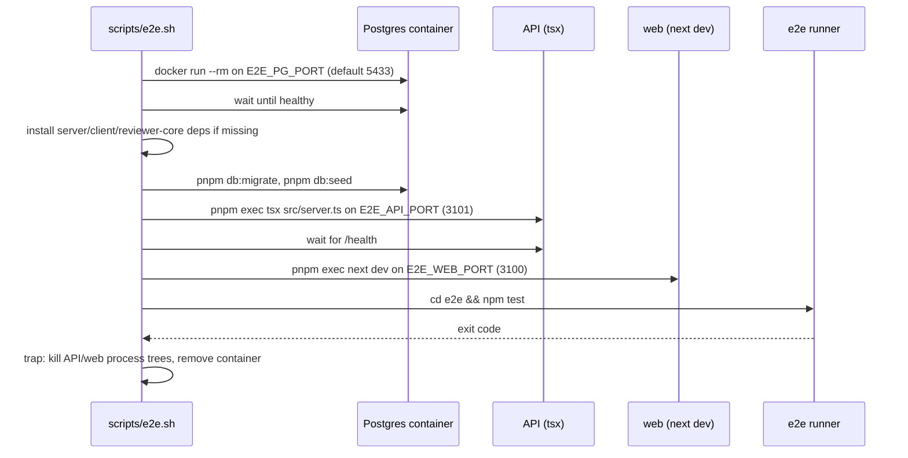

# The hermetic e2e stack

`npm run e2e:hermetic` runs `scripts/e2e.sh`. This page explains what the
script does, in order, and what the flows can and cannot see. How to write a
flow is in `README.md`.

## Lifecycle

- Env is exported before anything spawns. dotenv never overrides an existing
  variable, so `DATABASE_URL`, `API_PORT`, `WEB_PORT` and
  `NEXT_PUBLIC_API_BASE` beat `server/.env` without editing it.
- The Postgres container has no volume. Every run starts empty, so the seeded
  `acme/payments-api` is the only repo and `{BASE}/` redirects to it.
- The API runs through plain `tsx` rather than `pnpm start` (needs a build) or
  `tsx watch`.
- Teardown walks the process tree leaves-first, because `pnpm exec` starts the
  real listener as a grandchild and a plain `kill` would leave the port bound.
- CI doesn't use this script. `.github/workflows/e2e-web.yml` brings up its own
  stack and calls `npm test` directly.

## Prerequisites the script doesn't handle

- `e2e/node_modules`: the script installs deps for the other three packages but
  not for `e2e`. Without them it boots the whole stack and then fails at the end
  with `tsx: command not found` (exit 127). Run `cd e2e && npm ci` first.
- `agent-browser`: a missing binary only prints a warning. Install it once with
  `npm i -g agent-browser && agent-browser install`.
- A free alternate port set when a dev stack is already running, for example
  `E2E_PG_PORT=5633 E2E_API_PORT=3301 E2E_WEB_PORT=3300`.

## What the seed shows for the Run Cost lab

The seed (`server/src/db/seed.ts`) inserts a review but no `agent_runs` rows,
and flows must never trigger an LLM call. From that, and from the server and
client tests rather than an e2e run:

- `GET /repos/:id/pulls` returns `cost_usd: null` for every seeded PR, which the
  Cost column renders as `—` (`server/test/reviews.it.test.ts`,
  `client/src/app/repos/[repoId]/pulls/_components/PRRow/PRRow.test.tsx`);
- the PR detail timeline has no completed runs, so there is no `tok · $` line;
- there is no run trace to open a COST tile on.

No flow asserts on cost yet. If one is added, assert only the stable parts, such
as the `Cost` column header or the `—` placeholder. A real dollar value needs a
completed run, which needs a model call, so it belongs in server integration
tests and client component tests instead.
