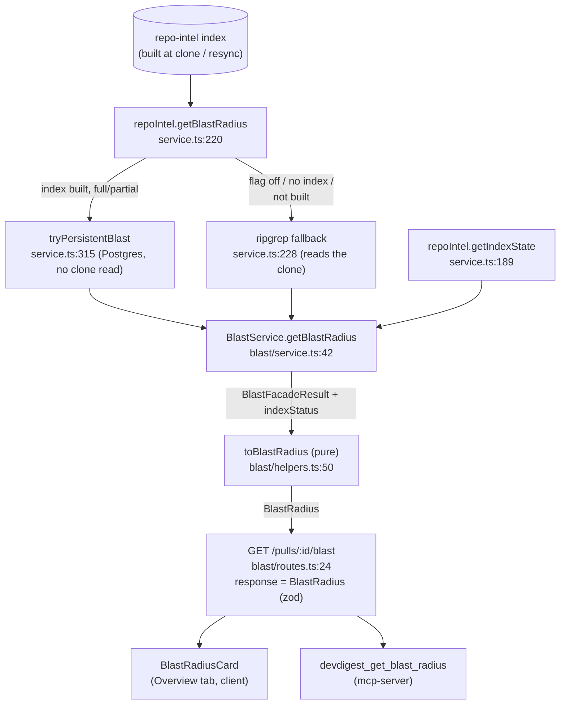

# Blast radius: data flow

What else in the repo a PR's change can break: the changed symbols, the code
that calls them (`file:line`), and the HTTP endpoints and cron jobs those
callers sit behind. All of it is read from the repo-intel index that already
exists — no LLM call, no re-parse of the diff. Served at
`GET /pulls/:id/blast`, rendered as the Overview tab's Blast radius card, and
exposed to agents as the `devdigest_get_blast_radius` MCP tool. The plan is
`docs/homework-5/plan.md`; the contract decision is
`decisions/2026-09-28-blast-radius-contract.md`.

## 1. What the map answers

For each symbol declared in a file the PR touched: who calls it (`file:line`,
one click to that exact line on GitHub) and, through those callers' files,
which HTTP endpoints and cron jobs are reachable. When the index behind the
answer is incomplete, the response says so and why.

## 2. The repo-intel facade

`RepoIntelService.getBlastRadius(repoId, changedFiles)`
(`server/src/modules/repo-intel/service.ts:220`) tries the persistent index
first, and falls back to a ripgrep-style read of the clone:

- **Persistent path** — `tryPersistentBlast` (`service.ts:315`). Requires an
  index state of `full` or `partial` (`service.ts:320`); reads changed-symbol
  declarations, resolved cross-file callers (`repository.ts:503`, an `INNER
  JOIN` against `file_rank` — a caller with no rank row never appears,
  `repository.ts:517`), the enclosing caller symbol, and per-file facts
  (endpoints/crons) straight from Postgres, with **no clone parsing on the hot
  path** (`service.ts:306`). When no changed symbol resolves, it returns
  `degraded: false` with empty `callers` (`service.ts:337`); otherwise it caps
  the caller list and returns `factsByFile` (`service.ts:376`, `:384`).
- **Ripgrep fallback** (`service.ts:228`) — used when the flag is off, or the
  persistent path returns `null` (index absent). It re-parses the clone via
  `container.codeIndex`, assigns every caller `rank: 0` (`service.ts:283`,
  "T1: no persistent rank yet"), and always returns `degraded: true, reason:
  'no_data'` (`service.ts:301`). It never populates `factsByFile`.

`getIndexState(repoId)` (`service.ts:189`) always returns a value: the
persisted `repo_index_state` row, or a synthesized `degraded: true, reason:
'no_data'` row when none exists (`service.ts:192`).

## 3. The `blast` module

`BlastService.getBlastRadius(workspaceId, prId)` (`server/src/modules/blast/service.ts:42`)
does exactly the reads the plan requires and nothing else:

1. loads the pull and its `pr_files` through `BlastStorePort`
   (`service.ts:43`, `:46`);
2. if `pr_files` is empty, refreshes it once through `refreshFiles`
   (`service.ts:48`-`:50`) — wired to `PullsService.refreshPullDetail`
   (`blast/wiring.ts:27`-`:30`), the same GitHub sync `GET /pulls/:id` uses;
3. reads `indexStatus` (`service.ts:52`);
4. calls the facade once with the changed files, unless the file list is
   still empty after the refresh — in that case it skips the facade entirely
   and returns an empty result, so a file-less PR gets `degraded` from the
   index status alone, never a false `no_data` (`service.ts:54`-`:60`);
5. maps the facade result through the pure `toBlastRadius` (`service.ts:62`);
6. logs one line, `blast: read repo-intel index`
   (`BLAST_LOG_MESSAGE`, `service.ts:11`), with `source: 'index'` when the
   facade result is not degraded and `'fallback'` otherwise
   (`service.ts:75`), plus `degraded`, `reason`, `symbols` and `callers`
   counts (`service.ts:71`-`:81`).

The service takes `BlastPorts`, not `Container` (`service.ts:28`); no port
exposes an indexing method, so a request can only read what is already
built — it never triggers a clone, index or resync job.
`blast/wiring.ts:18` composes those ports from `container.repoIntel`,
`container.reviewRepo` (as the store) and `buildPullsService`, and is the
only file in the module that imports `MAX_CALLERS_PER_SYMBOL` from
`repo-intel/constants.ts` (`wiring.ts:3`, `:32`) — the pure mapper takes the
cap as a parameter instead (`helpers.ts:53`).

## 4. The pure mapper: `toBlastRadius`

`server/src/modules/blast/helpers.ts:50` turns the facade's flat
`{changedSymbols, callers}` into the `BlastRadius` contract's grouped shape:

- **Group by `viaSymbol`.** Every caller row names the changed symbol it
  reaches (`viaSymbol`); callers are bucketed into one `downstream` group per
  symbol (`helpers.ts:71`-`:76`).
- **Self-exclusion.** A caller is dropped from a group when its own file is
  among *any* changed file that declares a symbol of that name — not just the
  first declaration (`helpers.ts:64`-`:69`, `:81`).
- **Cap.** Each group's callers are sorted, then sliced to
  `limits.maxCallersPerSymbol` (`helpers.ts:84`-`:85`) — the value wiring
  passes in from `MAX_CALLERS_PER_SYMBOL` (`repo-intel/constants.ts:30`,
  currently `20`). The persistent facade path already applies that same
  constant **globally** across all callers before the mapper sees them
  (`repo-intel/service.ts:386`, `callers.slice(0, MAX_CALLERS_PER_SYMBOL)`),
  so the mapper's per-symbol cap rarely has more than 20 callers to work
  with in the first place.
- **Endpoints/crons from `factsByFile`.** For each kept caller, its file's
  entry in `factsByFile` contributes endpoints and crons, deduplicated within
  the group in first-seen order (`helpers.ts:87`-`:104`). When
  `factsByFile` is absent (the ripgrep fallback never sets it), both come out
  `[]` (`helpers.ts:92`, short-circuits on `!facts`).
- **Ordering (rank).** Callers within a group sort by `rank` descending, then
  `file` ascending, then `line` ascending (`helpers.ts:31`-`:35`). Groups sort
  by their highest caller's rank descending, ties broken by symbol name
  ascending (`helpers.ts:116`-`:119`).
- **Degraded/reason.** `resolveDegraded` (`helpers.ts:128`-`:135`): if the
  facade result itself is degraded, pass its reason through (`no_data` if
  none given); otherwise, if the **index status** (not the facade) is
  `partial`, the mapper derives `degraded: true, reason: 'index_partial'` —
  the persistent facade path returns `degraded: false` even for a partial
  index (`repo-intel/service.ts:389`), so this derivation lives in the mapper
  by design (ADR "Trade-offs accepted"). Otherwise the result is clean.
- **Count rules and `summary`.** `blastSummary` (`helpers.ts:142`-`:161`)
  counts `changed_symbols.length` for symbols, the number of distinct
  `file:line` pairs across *all* groups for callers, and distinct strings
  across all groups for endpoints and crons — not a per-group sum, since a
  caller or an endpoint can repeat across groups. The same rule is
  re-implemented for the UI stat row (`client/.../BlastRadiusCard/helpers.ts:16`,
  `blastStats`) and for the MCP counts, so the three surfaces agree.

## 5. The route

`GET /pulls/:id/blast` (`server/src/modules/blast/routes.ts:24`) resolves the
workspace, calls `service.getBlastRadius` once, and throws `NotFoundError`
for an unknown pull (`routes.ts:29`-`:30`) — no adapter call in the handler.
`schema.response[200]` is the zod `BlastRadius` contract
(`server/src/vendor/shared/contracts/brief.ts:93`); Fastify's response
serializer `safeParse`s the return value and turns a contract-breaking body
into a 500 rather than leaking it.

The route is a GET that can write: an empty `pr_files` triggers the same
GitHub refresh `GET /pulls/:id` performs (§3, step 2).

### Contract shape

`BlastRadius` (`brief.ts:93`-`:100`): `changed_symbols` (`{name, file,
kind}`), `downstream` (`{symbol, callers, endpoints_affected,
crons_affected}`), `summary`, `degraded: boolean.nullish()`, `reason:
BlastDegradedReason.nullish()`. `BlastCaller` (`brief.ts:77`-`:83`) is
`{name, file, line, rank: number.nullish()}`. `BlastDegradedReason`
(`brief.ts:68`-`:75`) is one of `flag_off`, `index_failed`, `index_partial`,
`repo_too_large`, `no_data`. The route always emits `degraded` and `reason`
(never omits them); the `.nullish()` markers exist so a stored or older
payload without the fields still parses.

## 6. Consumers

### Overview-tab `BlastRadiusCard` (client)

`useBlastRadius(prId)` (`client/src/lib/hooks/blast.ts:11`) is a plain
`react-query` GET of `/pulls/:id/blast`. `OverviewTab`
(`.../OverviewTab/OverviewTab.tsx:21`) wires it alongside
`useRepoIntelStatus` and `useResyncRepoIntel`, and computes the GitHub link
SHA with `pickLinkSha(indexState.data?.lastIndexedSha, headSha)`
(`OverviewTab.tsx:29`, `helpers.ts:37`-`:44`): the index's own
`lastIndexedSha` wins, falling back to the PR's `head_sha`, else `null` — an
un-indexed repo has `lastIndexedSha === ''`, which is falsy.

`BlastRadiusCard` (`.../BlastRadiusCard/BlastRadiusCard.tsx:38`) is
presentational only: loading/error states, a four-stat header row from
`blastStats` (`helpers.ts:16`), an `IndexNotice` when `blast.degraded &&
blast.reason` (`BlastRadiusCard.tsx:96`, mapping each reason to a label via
`REASON_LABEL_KEY`, `IndexNotice.tsx:42`) shown above the map, a
Tree/Graph toggle when there is any `downstream`, and `noDownstream` text
with the symbol count when there is none (`BlastRadiusCard.tsx:105`). The
graph view (`BlastGraph.tsx`) is a plain SVG projection built by
`toGraphModel` (`helpers.ts:68`) over three columns — symbols, callers,
endpoints/crons — with nodes and edges deduplicated by id/pair.

### `devdigest_get_blast_radius` (mcp-server)

`getBlastRadius` (`mcp-server/src/app/blast-radius.ts:31`) resolves `repo` →
`pr`, calls `GET /pulls/:id/blast` exactly once (`blast-radius.ts:38`), then
maps the same map onto `BlastRadiusOut`, in server order, applying its own
caps (`MAX_SYMBOLS=10`, `MAX_CALLERS_PER_SYMBOL=8`, 5 endpoints/crons per
symbol, `MAX_FILE=160`, `MAX_NAME=80`, `MAX_ENDPOINT_OR_CRON=100`, summary
≤200 — `blast-radius.ts:10`-`:17`) and sanitising every repo-derived string
(`cap`, `blast-radius.ts:22`-`:26`). `truncated: true` whenever any cap cuts
content.

Per plan revision 5.1 (`docs/homework-5/plan.md` "Revision 5.1"), each caller
is flattened from `{name, file, line}` to one string, `"<file>:<line>
<name>"`, both parts capped and sanitised before joining
(`blast-radius.ts:61`-`:69`, `mcp-server/src/app/present.ts:117`,
`BlastDownstreamOut.callers: z.array(z.string())`) — this keeps the tool's
`tools/list` entry under its 10,240-byte budget. `notice` is the schema's
first key (`present.ts:123`-`:124`); `message` carries `M7` whenever
`degraded` (regardless of an empty map) or `M6` when not degraded and the
filtered/capped `downstream` is empty, else `null`
(`blast-radius.ts:92`-`:98`). The tool registration
(`mcp-server/src/tools/devdigest-get-blast-radius.ts:14`) uses the
try/catch → `isError` shape shared with the other tools.

## 7. Why there is no LLM call and no re-parse

Every value in the response comes from the repo-intel index that clone/index/
resync jobs already built, or (on the fallback path only) a direct clone
read done by the facade, not by `blast`. The `blast` module's ports expose no
indexing method (`service.ts:28`-`:37`) and nothing under
`server/src/modules/blast/` imports `llm`, `resolveFeatureModel`, `indexRepo`,
`refreshIndex` or `codeIndex`. The one log line per request,
`blast: read repo-intel index` (`service.ts:11`), carries `source: index |
fallback` so an operator can tell, from the log alone, whether an answer came
from Postgres or from a clone re-read.

## 8. Known limitations

- **The per-symbol caller cap is effectively global.** `MAX_CALLERS_PER_SYMBOL`
  (20) is applied once, across *all* callers of the request, by the facade
  before the mapper's own per-symbol cap runs (`repo-intel/service.ts:386`).
- **Direct callers only.** `BFS_DEPTH` (`repo-intel/constants.ts:49`) is used
  by `getCriticalPaths` (`repo-intel/service.ts:663`) but never by
  `getBlastRadius` — there is no transitive-caller walk.
- **Changed symbols and endpoints are file-level.** `changed_symbols` is
  every symbol declared in a changed file, not only the ones actually edited;
  endpoints/crons come from `factsByFile[caller.file]`
  (`helpers.ts:92`), so every route or job declared in a caller's file is
  listed, not only the handler that calls the symbol.
- **Callers without a `file_rank` row are dropped.** The persistent path's
  `INNER JOIN` on `file_rank` (`repository.ts:517`) excludes any resolved
  caller that has no rank.
- **The fallback path attributes no endpoints via `factsByFile`.** It has no
  persisted per-file facts and always returns `degraded: true, reason:
  'no_data'`; the "no re-parse" property holds only on the `source: index`
  path.

