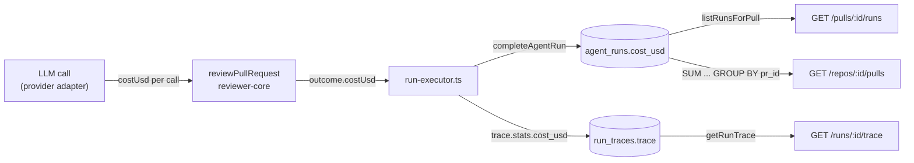

# Run cost: data flow

How one number, the USD cost of an agent run, gets from an LLM response to
three API responses. The spec is `server/specs/run-cost.md`.



## 1. Per-call cost

Each LLM adapter returns `costUsd` for one structured call.

- OpenRouter (`reviewer-core/src/llm/openrouter.ts:107`) prefers the real cost
  OpenRouter reports in `usage.cost`, then the injected estimator, then null.
  The server injects `PriceBook.estimate` (`server/src/platform/container.ts:185`),
  which uses live OpenRouter prices cached for six hours and falls back to the
  static table.
- OpenAI and Anthropic (`server/src/adapters/llm/openai.ts:84`,
  `server/src/adapters/llm/anthropic.ts:85`) use the static table in
  `server/src/adapters/llm/pricing.ts`. Unknown models return null.
- Test mocks return `0.001` per call (`server/src/adapters/mocks.ts:85`).

## 2. Per-run cost

`reviewPullRequest` adds the per-call costs across chunks. If any call is
unpriced, the run cost is null (`reviewer-core/src/review/run.ts:184`). See
`reviewer-core/docs/cost-accounting.md`.

## 3. Persisting

`ReviewService.runReview` creates one `batch_id` per request and passes it to
every `createAgentRun`. When a run finishes, `run-executor.ts` takes `costUsd`
from the outcome (`run-executor.ts:213`), writes it through `completeAgentRun`
(`run-executor.ts:253`, `repository/run.repo.ts:177`) and copies it into
`trace.stats.cost_usd` (`run-executor.ts:271`). The failure and cancel branches
don't pass a cost, so the column stays null.

## 4. Reading

- Run history: `listRunsForPull` maps the column to `cost_usd`
  (`repository/run.repo.ts:67`).
- Trace: the jsonb document is returned as stored. Traces written before this
  feature have no `cost_usd` key, which the client treats as missing.
- PR list: `server/src/modules/pulls/routes.ts:132` runs one grouped query next
  to the score lookup:

  ```sql
  SELECT pr_id, sum(cost_usd) FROM agent_runs
  WHERE pr_id IN (...) AND status = 'done'
  GROUP BY pr_id
  ```

  Postgres `sum` ignores nulls and returns null when every input is null, which
  keeps the "no data → —" rule without extra code. The query uses a raw
  `sql<number | null>` on purpose: drizzle's `sum()` helper maps the result to a
  string (`drizzle-orm/sql/functions/aggregate.js`), while postgres-js already
  returns `double precision` as a JS number and drizzle leaves nulls alone.

## Index

`agent_runs` had only its primary key. On synthetic data with 600k runs and 50
PRs per page, the list's cost lookup took 21.6 ms as a parallel seq scan and
3.4–5.9 ms with `agent_runs_pr_status_ran_idx`. The newest-first run history
(`listRunsForPull`) uses the same index. Measurements and the decision log are
in the ADR `decisions/2026-09-16-run-cost-storage.md` in the course workspace.
